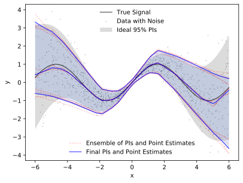

<div align="center">
    
    <h1>Prediction Intervals</h1>
    <p>
        <strong>Split Normal Mixture from Quality-Driven Deep Ensembles</strong>
    </p>
    <p>
        <a href="https://arxiv.org/abs/2007.09670">https://arxiv.org/abs/2007.09670</a>
    </p>
    <br>
</div>

This repository is accompanying the paper "[Prediction Intervals: Split Normal Mixture from Quality-Driven Deep Ensembles](https://arxiv.org/abs/2007.09670)" published at [UAI 2020](http://auai.org/uai2020/). The implementation contains the proposed method SNM-QD+, and it allows to reproduce the presented results.

## Requirements

```bash
pip install -r requirements.txt
```

or

```bash
conda env create --file environment.yml
```

## Usage

Experiments:

```bash
source exp_{qdp2|qd2|mve2|mse2}.sh
```

Hyper-parameter search (HPS):

```bash
source hps_{qdp2|qd2|mve2|mse2}.sh
```

> To learn how to execute/reproduce an experiment or HPS on a single dataset, please have a look inside the shell scripts (`*.sh`).
> All output artifacts are stored in an automatically created `runs` directory.

## Feedback

For questions, suggestions, feedback or bug reports, please open an issue or contact us via email (to be found in the [paper](https://arxiv.org/abs/2007.09670)).

## Citation

```
@InProceedings{pi-snm-qde,
  title = {Prediction Intervals: Split Normal Mixture from Quality-Driven Deep Ensembles},
  author = {S. Salem, T{\'a}rik and Langseth, Helge and Ramampiaro, Heri},
  booktitle = {Proceedings of the 36th Conference on Uncertainty in Artificial Intelligence (UAI)},
  year = {2020}
}
```